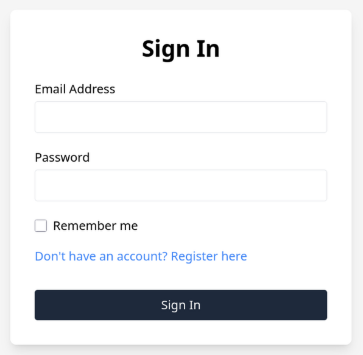

## htmgo advanced authentication example

A more advanced [htmgo](https://github.com/maddalax/htmgo) example web app built upon the [simple-auth](https://github.com/maddalax/htmgo/tree/master/examples/simple-auth) provided in the official repo.

### Added features:
- **Remember me** - an option for a more persistent session. Implemented with an industry-standard [selector-validator pattern](https://paragonie.com/blog/2015/04/secure-authentication-php-with-long-term-persistence). Includes a token-rotation-based cookie theft detection that invalidates all access tokens and alerts the user. Standard session length reduced to 2h, while the remember me option gives a 30 day persistent cookie that refreshes and rotates with every use.
- [**Argon2**](https://pkg.go.dev/golang.org/x/crypto/argon2) - a more modern password hashing algorithm. Due to an absence of a higher-level Go API this example is a bit more verbose than the bcrypt one.
- **Session invalidation on log out** - Logging out invalidates the session (and the remember me) cookies in the database.
- **Cleaning up old sessions from the database** - A once-a-day cron job removes the expired sessions and remember me tokens from the database.

Login page:

